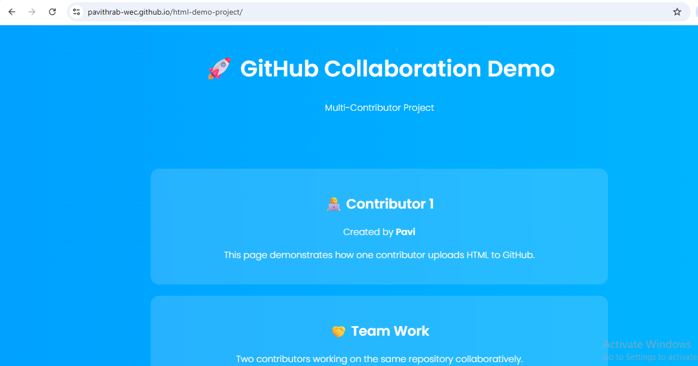

# GitHub Collaboration Demo

This project is a simple multi-page HTML website created to demonstrate how two contributors can work together in the same GitHub repository. It is designed as a beginner-friendly example for learning repository setup, collaboration, version control, and basic deployment.

## Project Overview

The demo includes:

- A landing page for Contributor 1
- A second page for Contributor 2
- Navigation between both pages
- A simple visual design using HTML and CSS
- A structure suitable for GitHub Pages deployment

## Features

- Demonstrates two-contributor collaboration in one repository
- Uses plain HTML and CSS for easy understanding
- Shows page linking between `index.html` and `about.html`
- Includes contributor profile images in the `image/` folder
- Suitable for classroom, seminar, or beginner GitHub demonstrations

## Project Structure

```text
demo/
|-- index.html
|-- about.html
|-- README.md
`-- image/
    |-- contributor1.png
    `-- contributor2.png
```

## Contributors

<table>
  <tr>
    <td align="center">
      <br>
      <strong>Contributor 1</strong>
    </td>
    <td align="center">
      <br>
      <strong>Contributor 2</strong>
    </td>
  </tr>
</table>

## Getting Started

1. Clone or download this repository.
2. Open the project folder in Visual Studio Code.
3. Launch `index.html` in your browser.
4. Use the navigation links to move between pages.

## Git Workflow Example

```bash
git init
git add .
git commit -m "Initial commit"
git branch -M main
git remote add origin <your-repository-url>
git push -u origin main
```

## Deployment

This project can be deployed easily with GitHub Pages:

1. Push the project to GitHub.
2. Open the repository settings.
3. Enable GitHub Pages from the main branch.
4. Use the generated public URL to view the site online.

## Purpose

This repository is useful for demonstrating:

- Basic Git and GitHub workflow
- Contributor-based collaboration
- Version control for small web projects
- Simple static website hosting

## License

This project is available for educational and demonstration purposes.
